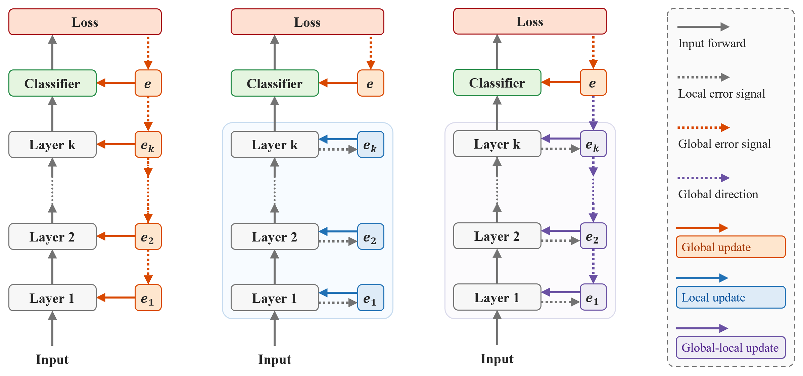

<div align="center">

# Hebbian Learning with Global Direction

Wenjia Hua, Kejie Zhao, Luziwei Leng, Ran Cheng, Yuxin Ma, Qinghai Guo  
**ICASSP 2026**

</div>

Hebbian learning has attracted considerable interest as a biologically plausible alternative to backpropagation. Nevertheless, its exclusive reliance on local information, without consideration of global task objectives, fundamentally limits its scalability. Inspired by the biological synergy between neuromodulators and local plasticity, we introduce a novel model-agnostic **G**lobal-guided **H**ebbian **L**earning **(GHL)** framework, which seamlessly integrates local and global information to scale up across diverse networks and tasks. In specific, the local component employs Oja's rule with competitive learning to ensure stable and effective local updates. Meanwhile, the global component introduces a sign-based signal that guides the direction of local Hebbian plasticity updates. Extensive experiments demonstrate that our method consistently outperforms existing Hebbian approaches. Notably, on large-scale network and complex datasets like ImageNet, our framework achieves the competitive results and significantly narrows the gap with standard backpropagation.

> [!TIP]  
> This repository provides minimal, illustrative code examples demonstrating how to apply the GHL framework to train DeepHebb and FastHebb architectures on the CIFAR-10 dataset.  
> The code is designed to clearly showcase the core algorithmic principles of GHL as described in the paper, rather than to serve as a production-ready implementation.

## Overview


**Comparison of different training methods**. **Left:** Standard BP training process, using global error signals to compute precise gradients for weight updates. **Middle:** Two-factor Hebbian learning approach, which relies only on local information from pre and post synaptic neurons to update weights, without considering global task objectives. **Right:** Our method, Global-guided Hebbian Learning (GHL), integrates local Hebbian plasticity with a global sign-based modulation.

## Results

### CIFAR-10/100 test accuracy (%)

| Arch      | Method         | CIFAR-10          | CIFAR-100         |
|-----------|----------------|-------------------|-------------------|
| DeepHebb  | SoftHebb       | 80.36 (-6.62)     | 55.94 (-7.64)     |
|           | **GHL (Ours)** | 86.41 (**-0.57**) | 62.40 (-1.18)     |
|           | E2E BP         | 86.98             | 63.58             |
| FastHebb  | SWTA-FH        | 55.23 (-29.48)    | 21.04 (-36.45)    |
|           | HPCA-FH        | 67.73 (-16.98)    | 37.47 (-20.02)    |
|           | **GHL (Ours)** | 83.96 (-0.75)     | 57.23 (**-0.26**) |
|           | E2E BP         | 84.71             | 57.49             |

### ImageNet (ILSVRC 2012) Top-1/5 validation accuracy (%)

| Arch       | Method        | Top-1 Acc        | Top-5 Acc        |
|------------|---------------|------------------|------------------|
| DeepHebb   | SoftHebb      | 26.08 (-32.76)   | 41.05 (-39.43)   |
|            | GHL (Ours)    | 53.71 (-5.13)    | 76.02 (-4.46)    |
|            | BP E2E        | 58.84            | 80.48            |
| FastHebb   | SWTA-FH       | 4.75 (-51.89)    | 12.49 (-67.15)   |
|            | HPCA-FH       | 19.42 (-37.22)   | 42.22 (-37.42)   |
|            | GHL (Ours)    | 50.80 (-5.84)    | 74.56 (-5.08)    |
|            | BP E2E        | 56.64            | 79.64            |
| VGG-16     | GHL (Ours)    | 65.58 (-5.92)    | 86.49 (-3.61)    |
|            | BP E2E        | 71.50            | 90.10            |
| ResNet-18  | GHL (Ours)    | 65.78 (-3.79)    | 86.45 (-2.79)    |
|            | BP E2E        | 69.57            | 89.24            |
| ResNet-50  | **GHL (Ours)**| 73.14 (**-2.85**)| 91.04 (**-1.94**)|
|            | BP E2E        | 75.99            | 92.98            |

For more experimental results and algorithmic details, please refer to the paper.

## Quick Start

You can run the training script with the following command:
```bash
python train.py  --model DeepHebb --lr_conv 1e-2 --wd_conv 5e-2 --lr 5e-3 --device 0
python train.py  --model FastHebb --lr_conv 5e-2 --wd_conv 1e-2 --lr 1e-4 --device 1
```

## Citation
If you find our work useful, please consider citing our paper:
```bibtex

```
